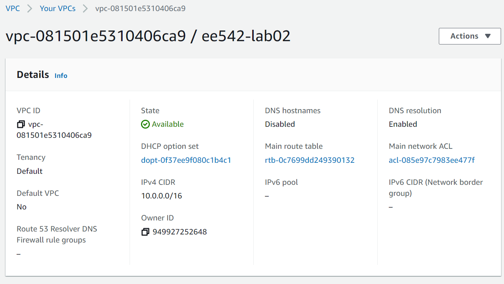
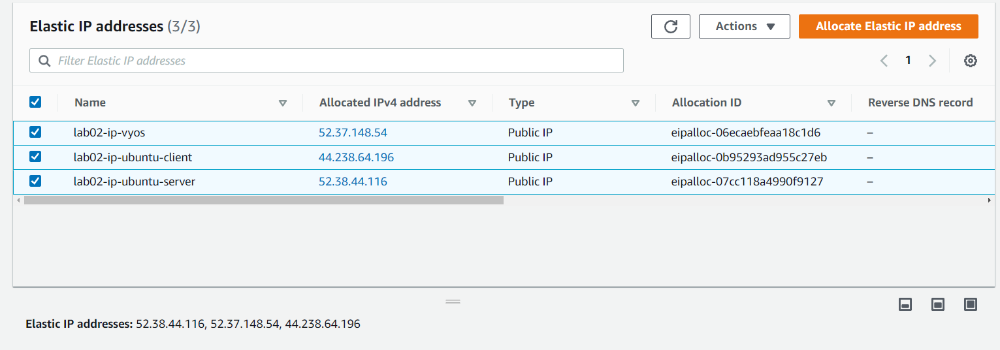
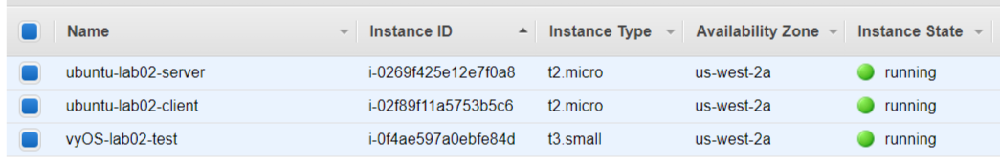

# EE542 - Lab02

### Building a Server-Router-Client topological model on AWS
---
#### Topics:

- Initializing Virual Private Cloud (VPC) service and EC2 instances on AWS
- Using AWS VPC services and EC2 instances to build a Server-Router-Client network model
- Exploring to configure routing settings for different components in Computer Networks
- Learning to install iPerf and iPerf3 tools on Linux to measure the bandwidths of computers' network access

#### Author: [Boyang Xiao](https://www.linkedin.com/in/boyang-xiao-40b644225/)

- **USC id**:		3326-7302-74
- **Email**:		<a href="mailto:boyangxi@usc.edu">boyangxi@usc.edu</a>
- **Github**:	[here](https://github.com/SeanXiaoby)

#### Dev Environment:

- **AWS acount:** Free tier
- **Installed VM OS**: [vyOS 1.3](https://aws.amazon.com/marketplace/pp/prodview-o7dahbop7getw?sr=0-1&ref_=beagle&applicationId=AWSMPContessa), [Ubuntu 18.04 LTS](https://aws.amazon.com/marketplace/pp/prodview-pkjqrkcfgcaog?sr=0-1&ref_=beagle&applicationId=AWSMPContessa)

#### [Video Introductions]()

---
## Creating VPC and EC2 instances on AWS

#### VPC configuration
Click on AWS VPC console and create a new VPC by clicking the button on the upper-right corner

Configurations for VPC (as shown in the following picture):
    - **Name**: ee542-lab02
    - **IPv4 CIDR**: 10.0.0.0/16
    - **Disable** IPv6 CIDR

Click on the subnets tab on the left side-bar. Add four subnets to the VPC, partitioning the IPv4 CIDR into four domains:
    - Subnet-1: 10.0.1.0/24
    - Subnet-2: 10.0.2.0/24
    - Subnet-3: 10.0.3.0/24
    - Subnet-4: 10.0.4.0/24




#### Get Elastic IP addresses assigned by AWS
An [elastic ip](https://docs.aws.amazon.com/AWSEC2/latest/UserGuide/elastic-ip-addresses-eip.html) addresse is a static IPv4 address designed for dynamic cloud computing. An Elastic IP address is allocated to your AWS account, and is yours until you release it. 

Click the Elastic IP tab on the left side-bar. Allocate **three elastic ip addresses** for further use.

These three elastic ip addresses can be the public IPv4 addresses for the ServerVM, RouterVM and ClientVM, which can be used to access the open Internet by the virtual machines.

❗When the elastic ip addresses are associated with an EC2 instance, it will be billed a little amount of fee, even if the instance is closed. Please release the elastic ip addresses if they are not in use anymore to avoid more billings!!




#### Create EC2 (Elastic computing clouds) instances 
[Amazon Elastic Compute Cloud (Amazon EC2)](https://docs.aws.amazon.com/AWSEC2/latest/UserGuide/concepts.html) provides scalable computing capacity in the Amazon Web Services (AWS) Cloud. Using Amazon EC2 eliminates your need to invest in hardware up front, so you can develop and deploy applications faster. You can use Amazon EC2 to launch as many or as few virtual servers as you need, configure security and networking, and manage storage. Amazon EC2 enables you to scale up or down to handle changes in requirements or spikes in popularity, reducing your need to forecast traffic.
  - Create one instance and install vyOS 1.3 in it as a RouterVM.
  - Create two instances and install Ubuntu 18.04 in them as a ClientVM and a ServerVM.



---

## Building a Server-Router-Client model on AWS

#### Configure routing relations for EC2 instances
Configure two network interfaces for each instance, one for SSH access, the other for internal networks access.
  - The network interfaces which are connecting to the outside internet **should be associated with one of the elastic IP addresses** we got. The instance can use this interface to connect to the open Internet domains and can also be accessed by outside SSH clients.
  - The network interfaces which are used for internal communications should **share the same subnet domains** for three instances so that they can access to each other in this same subnet domains. Here, we chose 10.0.2.0/24 domain as the internal networks domain.

The mapping relations between each instance's network interfaces is shown below.

|Instance name  | OS |    Network interface #   | Subnet domain| Mapping to| Usage|
|---|----|----| ---| ---| --- |
|vyOS-lab02-router|vyOS 1.3| eth0| 10.0.1.0/24 | Elastic ip #1: lab02-ip-vyos| SSH access from outside|
|...    | ...   |eth1| 10.0.2.0/24| Client and Server VMs| Internal communications|
|Ubuntu-lab02-Client| Ubuntu 18.04| eth0 | 10.0.2.0/24| Router VM| Internal communications|
|...| ...| eth1| 10.0.3.0/24| Elastic ip #2: lab02-ip-client| SSH access from outside|
|Ubuntu-lab02-Server| Ubuntu 18.04| eth0 | 10.0.2.0/24| Router VM| Internal communications|
|...| ...| eth1| 10.0.4.0/24| Elastic ip #3: lab02-ip-server| SSH access from outside|

#### Launch the instances and access them by SSH
Create and launch three instances and wait for them to be prepared. When the instances are ready and the elastic ip addresses are configured right, we should be able to ping these three elastic ip addresses well. [Here](https://networkappers.com/tools/ping-tool) is a little online Ping tool we can use to test that.

**Authentication:** When creating the instances, AWS should create a key pair for them. This is for authentication when logging into the instances, so we don't need to input user/passwd. This should be a [*.pem] file and please keep it safe on the local end.

Open three terminal windows on the local end. Enter the folder where the .pem file is, and input the following commond to *SSH* into the instances' OS:

```shell
ssh -i "lab02.pem" <OS name>@<ELastic ip address>
```

For example: If we want to *ssh* into the vyOS router vm, we can execute:
```shell
ssh -i "lab02.pem" vyos@52.37.148.54
```
Or if we want to *ssh* into the Server VM, we can :

```shell
ssh -i "lab02.pem" ubuntu@52.38.44.116
```
In this way, we can access and operate on the instances operating systems we created. 

⚠ **There is one thing we should be careful with:**

If the ELastic IP is associated with a eth1 interface of a instance, we may not be able to access to it through SSH, since the initialized Linux VM has no open& running eth1 interface but only has eth0. We can associate the elastic ip address with eth0 and get into the instance first. Than we open up eth1 and configure its IPv4 address as allocated by AWS and set the routing rules. We can refer to [this post](https://serverfault.com/questions/1066245/cannot-ssh-to-second-network-interface-in-ubuntu-20-04-on-ec2) to set the rules.

---

## Test networks connections for the model and set routing rules

##### Goal:
- Make these three Vms can connect with each other under the same subnet domain.
- Build the routing model: When Server and Client communicates with each other, the traffic should be like:
  - Server -> Router -> Client
  - Client -> Router -> Server