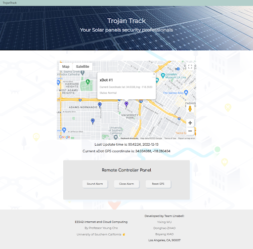
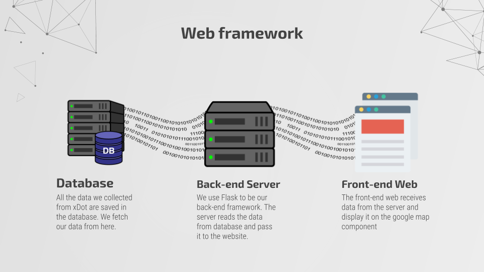

# EE542 - Trojan Tracking system 📡

#### Author: [Boyang Xiao](https://www.linkedin.com/in/boyang-xiao-40b644225/)

- **Email**: 👉<a href="mailto:boyangxi@usc.edu">boyangxi@usc.edu</a>
- **Github**: 👉[SeanXiaoby](https://github.com/SeanXiaoby)

#### Dev Environment:

- **OS:** Linux / Windows 11
- **Backend Framework:** [Flask](https://flask.palletsprojects.com/en/2.2.x/)
- **Database:** [Amazon DynamoDB](https://www.googleadservices.com/pagead/aclk?sa=L&ai=DChcSEwjtlZPN0Ln8AhWvGq0GHVADAJQYABABGgJwdg&ohost=www.google.com&cid=CAESauD2jWbm-g9PX6kofo3oqSOVelm70oJRC7__dRUfMC9QZZ_dXlug_CC5B1hk4eY6EkxuX8ZRYJRl4o3pQmIeXdOo_Nv4krsphPvPccsMTwR5MNOxyrza1hB7NPcEvpqU0fWqjevkLnXvsEw&sig=AOD64_1_cXZRlVlLarD3PB_aJGp3OhiJLA&q&adurl&ved=2ahUKEwig4IzN0Ln8AhUFI0QIHYRXC-UQ0Qx6BAgKEAE)
- **Frontend components:** [Google map API](https://developers.google.com/maps)
- **Language:** Python, HTML/CSS, Javascript

#### Project Info:
- **Team members:**
   - [Boyang Xiao](https://github.com/SeanXiaoby)
   - [Yixing Wu](https://github.com/star-wyx)
   - [Donghao Zhao](https://github.com/Donghao-Zhao)
- **Instructor:** [*Young Cho*](https://www.isi.edu/~youngcho/)
- **Video presentation:** 👉[IoT Based Solar Panel Security System Demonstration](https://youtu.be/FzzhRRPaA0I)
- **Project presentation slides:** 👉[here](https://docs.google.com/presentation/d/1JzfGuFflzX9l6GCJ3iJTRB1S7GJ8296l/edit?usp=share_link&ouid=103751333987484781165&rtpof=true&sd=true)

---

## Trojan Tracking System

In this project, we builded an IoT-based tracking system, which can:

- Tracking items' locations
- Save items' locations to the Database
- Display items' locations on our Website



#### Hardware

For the harware part, we use [MultiTech xDot](https://www.multitech.net/developer/products/multiconnect-dot-series/multiconnect-xdot/) as our hardware platform, and [MultiTech LoRa Conduit](https://www.multitech.com/brands/multiconnect-conduit?gclid=CjwKCAiA8OmdBhAgEiwAShr405GvUUTh8jAn9K6GmQtL1ek4NRfO0v30qxOyB-Sp9TdTagpcW45hoBoCZ_gQAvD_BwE) as our network gateway. With installation of the GPS model, [MultiTech xDot](https://www.multitech.net/developer/products/multiconnect-dot-series/multiconnect-xdot/) can collect the GPS coordinates of its own location and send them to the database through the [MultiTech LoRa Conduit](https://www.multitech.com/brands/multiconnect-conduit?gclid=CjwKCAiA8OmdBhAgEiwAShr405GvUUTh8jAn9K6GmQtL1ek4NRfO0v30qxOyB-Sp9TdTagpcW45hoBoCZ_gQAvD_BwE) gateway. **This repo does not contain this part, but you can find more of this part in our [video presentation]((https://youtu.be/FzzhRRPaA0I)).**

#### Software



After the DynamoDB collects the coordinates from [MultiTech xDot](https://www.multitech.net/developer/products/multiconnect-dot-series/multiconnect-xdot/), we can fetch the data to our backend server. The Backend server would pass all the data to the frontend website and display the coordinates as markers on the Google map component. Also, we add some other information to display on the website, such as the timestamps, sensor No. and hardware status.

Except for the coordiante displaying functionality, our website also has a controlling panel to control the hardware. You can make the hardware to play alarms through the speaker or reset all the status.

---

## Environment settings

**Notes:** Since the hardware has been removed, our website might appear to show some problems right now.

#### Flask

```shell
pip install Flask
```

#### Google map API

Please go to [Google map API](https://developers.google.com/maps) official portal to register for an account and get the API access.

#### AWS DynamoDB

Please install AWS CLI on your local environment and set up all the AWS settings, including the credentials and regions

You can refer to this tutorial: 👉 [here](https://docs.aws.amazon.com/cli/latest/userguide/cli-configure-files.html)

#### Python external libraries

Please install whatever libraries needed for Python when you complile the repo.

---

## Compile and Launch

- To run the app on your local machine:

```shell
flask --app main run
```

And you can access the website on [127.0.0.1:5000](127.0.0.1:5000)

- To launch the repo on the Linux server, please use Gunicorn:

```shell
$ pip install gunicorn
$ gunicorn -w 4 myapp:app
```